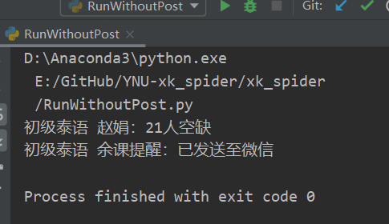
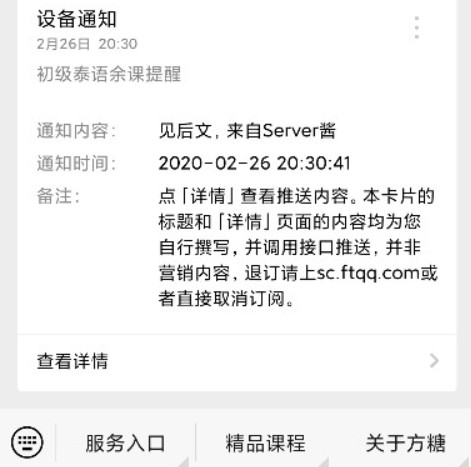
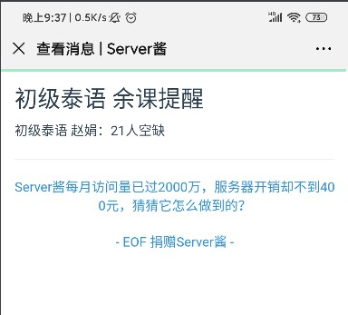
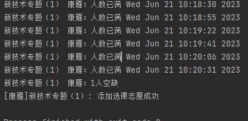

# YNU-xk_spider（重构版）

**云南大学选课爬虫，提供余课提醒和自动抢课服务**
**此版本为重构版，如遇bug可使用原版修复版[YNU-xk_spider](https://github.com/davidwushi1145/YNU-xk_spider)。**
## 项目简介

YNU-xk_spider 是一个针对云南大学选课系统的自动化工具，提供余课提醒服务并支持自动抢课功能。该工具能够通过 server 酱将余课提醒发送至微信，用户可以实时收到选课信息。

项目来源于 [YNU-xk_spider](https://github.com/starwingChen/YNU-xk_spider)，在此基础上解决了自动注销问题并修复了若干已知 bug。经过多次测试，程序运行稳定，支持长时间持续运行。

## 更新日志

- **2023-6-23**：解决自动注销问题，测试三小时无注销。
- **2023-12-28**：修复 API 接口问题，多系统测试无异常。
- **2023-12-30**：测试 24 小时无异常。
- **2024-3-8**：修复所有已知 bug，遇到问题请提交 issue。
- **2024-6-26**：进一步优化和修复，提升稳定性。
- **2024-9-9**：修复若干bug，代码架构完全重构。

## 环境要求

- **Python 版本**：3.10
- **依赖库**：
    - `selenium 4.1.0`
    - `requests`
    - `flask 3.0.0`
    - `ddddocr 1.4.10`
    - `fake_useragent`
- **浏览器及驱动**：最新版 Chrome 及对应的 ChromeDriver

## 功能说明

- **余课提醒**：通过 server 酱接口将余课信息发送至微信，用户需自行从 [server 酱官网](https://sct.ftqq.com/) 获取 key，并关注 "方糖" 服务号。
- **自动抢课**：支持主修（包括必修和专选）和素选课程的提醒与抢课功能（体育课和跨专业选修课程未测试）。

## 使用步骤

1. **安装环境**：确保 Python 和所需依赖库已安装，下载并解压本程序。
2. **切换目录**：进入 `YNU-xk_spider-master` 目录。
3. **安装依赖**：运行 `pip install -r requirements.txt` 安装所需的 Python 库。
4. **启动 API**：运行 `api.py` 文件，确保验证码识别 API 正常运行。
5. **编辑配置**：打开 `config.py` 文件，按注释填写必要字段。
6. **运行程序**：保存修改并运行程序，程序将自动开始循环执行并打开一个窗口进行登录。

程序已尽量封装，便于小白用户使用，按注释填写字段即可运行。若遇到问题，可在 issue 中提出。

## Chrome 浏览器驱动

由于程序使用 Selenium 模块，必须下载并配置 Chrome 浏览器驱动。可参考 [这篇教程](https://blog.csdn.net/mingfeng4923/article/details/130989513)，不需要添加环境变量，只需记住下载路径。

下载 ChromeDriver：[ChromeDriver 下载地址](https://googlechromelabs.github.io/chrome-for-testing/)

## 自行搭建 API

1. 安装必要依赖：
   ```bash
   pip install ddddocr
   pip install flask
   ```
2. 运行 `api.py`：
   ```bash
   python api.py
   ```
   可在本地运行或在云服务（如腾讯云函数）上搭建。

## 云函数搭建方法

1. 拉取 OCR Docker 镜像：
   ```bash
   docker pull ccr.ccs.tencentyun.com/ocrr/ocr:2.0.0
   ```
2. 上传至自己的仓库并部署到云函数，使用 Docker 部署。

3. 修改 `AutoLogin.py` 中的 `imgcode_online` 函数，调整 API 请求路径。

## 成功示例

以下为余课提醒和自动抢课的成功示例：






## 声明

本程序仅用于技术交流，请勿用于任何形式的收费行为。

**如果本项目对你有帮助，欢迎点右上角的 star 支持 :)**

