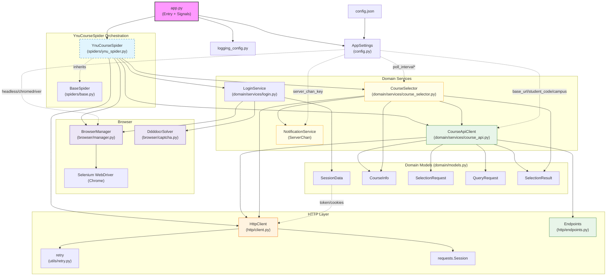

# YNU-xk_spider（重构版 v2.0）

> [!CAUTION]
>
> Disclaimer / 声明
>
> 本程序仅供技术交流学习使用，严禁任何形式的商业用途或收费行为。若发现违规收费，我们将立即停止后续一切维护。
>
> This program is for technical exchange ONLY. Commercial use or charging fees is strictly prohibited.

**云南大学选课爬虫，提供余课提醒服务，实现自动抢课功能。**

此版本为**架构重构版**，采用现代 Python 工程实践完全重写，具备清晰的模块分层、完整的类型注解和企业级代码规范。

---

## 架构升级

| 特性               | 描述                                                   |
| ------------------ | ------------------------------------------------------ |
| **现代项目结构**   | 采用 `/src` 布局，模块职责清晰分离                     |
| **Pydantic 配置**  | 类型安全的配置验证，支持环境变量覆盖                   |
| **单例浏览器管理** | `BrowserManager` 线程安全单例，统一 WebDriver 生命周期 |
| **重试机制**       | 指数退避 + 随机抖动的网络重试装饰器                    |
| **优雅停机**       | 信号处理 + `threading.Event` 实现无损退出              |
| **自定义异常**     | 完整的异常层次结构，精准定位问题                       |
| **完整类型注解**   | 100% Type Hints + Google Style Docstrings              |

---

## 功能特性

- **极速识别**：内置 `ddddocr` 模型，毫秒级本地识别验证码
- **智能登录**：慢速连点 + 验证码熔断机制，从容应对系统卡顿
- **实时监控**：自动刷新课程余量，检测到空位立即提交
- **多课程支持**：覆盖素选课、主修课（必修/专选）、体育课
- **并发抢课**：线程池并行监控多门课程
- **会话保活**：自动检测过期并重新登录
- **微信提醒**：集成 Server酱推送，结果即时送达
- **通知收尾**：提醒异步发送，监控批次结束前会等待通知线程完成，降低退出时丢消息风险
- **登录稳健性**：仅在检测到真实选课页信号（`aPublicCourse` 或 `currentBatch`）后继续会话提取

---

## 最近更新

- 修复并发线程数计算：`max_workers` 现在被严格视为上限，不再被课程数强制抬高
- 优化通知发送：移除 daemon 通知线程，新增等待机制，确保进程收尾阶段尽量完成推送
- 强化登录页面判定：`_wait_course_page_ready` 不再仅凭 URL 中 `token=` 判定成功
- 增强 `courseBtn` 容错：按钮瞬时缺失时会告警并重试，避免直接抛错中断
- 改进调试可观测性：准备点击 `courseBtn` 的最佳努力步骤失败时输出 `DEBUG` 日志
- 补充回归测试覆盖以上场景（当前测试集共 11 项，均通过）

---

## 项目结构

```bash
src/ynu_xk_spider/
├── __init__.py
├── app.py                 # 应用入口与信号处理
├── config.py              # Pydantic 配置模型
├── exceptions.py          # 自定义异常层次
├── logging_config.py      # 日志配置
├── utils/
│   └── retry.py           # 重试装饰器
├── browser/
│   ├── manager.py         # BrowserManager 单例
│   └── captcha.py         # 验证码识别抽象
├── http/
│   ├── client.py          # HTTP 客户端封装
│   └── endpoints.py       # API 端点构建器
├── domain/
│   ├── models.py          # 领域模型
│   └── services/
│       ├── login.py       # 登录服务
│       ├── course_api.py  # 课程 API 客户端
│       └── course_selector.py  # 选课业务逻辑
└── spiders/
    ├── base.py            # BaseSpider 抽象基类
    └── ynu_spider.py      # YNU 选课爬虫实现
```

---

## 环境要求

| 依赖             | 版本要求           |
| ---------------- | ------------------ |
| **Python**       | 3.10+              |
| **Chrome**       | 最新稳定版         |
| **ChromeDriver** | 与 Chrome 版本匹配 |

---

## 📖 快速开始

### 1. 安装

```bash
git clone https://github.com/gaizhongtan/YNU-xk_spider_Refactoring.git
cd YNU-xk_spider_Refactoring

# 方式一：pip 安装（推荐）
pip install -e .

# 方式二：仅安装依赖
pip install -r requirements.txt
```

### 2. 下载 ChromeDriver

前往 [Chrome for Testing](https://googlechromelabs.github.io/chrome-for-testing/) 下载与浏览器版本匹配的驱动。

> Selenium 4.x 支持自动下载驱动，通常无需手动配置。

### 3. 配置

复制示例配置并修改：

```bash
cp config.sample.json config.json
```

编辑 `config.json`：

```json
{
  "student_code": "你的系统学号",
  "password": "你的系统密码",
  "server_chan_key": "",
  "chrome_driver_path": "",
  "headless": false,
  "log_level": "INFO",
  "poll_interval_min": 3.0,
  "poll_interval_max": 6.0,
  "campus": "02",
  "courses": {
    "public": [
      {"name": "课程名称", "teacher": "授课老师"}
    ],
    "pe": [
    ],
    "program": [
    ]
  }
}
```

#### 课程配置示例

```json
{
  "courses": {
    "public": [
      {"name": "数据之美——数据可视化应用", "teacher": "朱一"},
      {"name": "人工智能导论", "teacher": "张二"}
    ],
    "pe": [
      {"name": "羽毛球（四）", "teacher": "范三"}
    ],
    "program": [
      {"name": "大学生创新创业教育", "teacher": "段四"}
    ]
  }
}
```

> 不抢某类课程时，保持空数组 `[]` 即可。

#### 配置说明

| 字段                 | 类型   | 说明                                   |
| -------------------- | ------ | -------------------------------------- |
| `student_code`       | string | 教务系统学号                           |
| `password`           | string | 教务系统密码                           |
| `server_chan_key`    | string | Server酱推送 Key，留空禁用             |
| `chrome_driver_path` | string | ChromeDriver 路径，留空自动检测        |
| `headless`           | bool   | 是否无头模式运行浏览器                 |
| `log_level`          | string | 日志级别：DEBUG/INFO/WARNING/ERROR     |
| `poll_interval_min`  | float  | 最小轮询间隔（秒）                     |
| `poll_interval_max`  | float  | 最大轮询间隔（秒）                     |
| `campus`             | string | 校区代码：`02`=呈贡校区，`01`=东陆校区 |
| `courses.public`     | array  | 素选课列表                             |
| `courses.pe`         | array  | 体育课列表                             |
| `courses.program`    | array  | 主修课列表                             |

#### 向后兼容

同时支持旧版数组格式：

```json
["课程名称", "授课老师"]
```

#### 环境变量覆盖

所有配置项支持环境变量覆盖，前缀为 `YNU_XK_`：

```bash
export YNU_XK_STUDENT_CODE="20xxxxxxxx"
export YNU_XK_PASSWORD="your_password"
export YNU_XK_HEADLESS="true"
```

### 4. 运行

```bash
# 方式一：模块运行
python -m ynu_xk_spider

# 方式二：CLI 命令（需 pip install -e .）
ynu-spider

# 指定配置文件
ynu-spider -c /path/to/config.json

# 启用无头模式
ynu-spider --headless

# 调整日志级别
ynu-spider --log-level DEBUG
```

如需限制监控并发（`max_workers`），请使用 Python API（CLI 暂未开放该参数）：

```python
from pathlib import Path

from ynu_xk_spider.config import AppSettings
from ynu_xk_spider.spiders.ynu_spider import YnuCourseSpider

settings = AppSettings.load(Path("config.json"))
spider = YnuCourseSpider(settings, max_workers=3)
spider.start()
```

`max_workers` 语义说明：

- 仅在显式传入时生效
- 最小值为 `1`
- 实际线程数为 `min(max_workers, 课程总数)`

### 5. 停止

按 `Ctrl+C` 优雅停机，程序会等待当前操作完成后退出。

---

## ⚙️ 高级配置

### HTTP 参数

可在配置中调整网络行为：

```json
{
  "http_timeout": 10.0,
  "max_retries": 5,
  "retry_backoff": 0.5,
  "retry_factor": 2.0
}
```

### 日志输出

日志同时输出到控制台和文件：

- 控制台：彩色格式化输出
- 文件：`logs/spider.log`（自动轮转，单文件 5MB，保留 3 份）

---

## 架构设计


```mermaid
 graph TD
      %% Entry
      App["app.py<br/>(Entry + Signals)"]
      Settings["AppSettings<br/>(config.py)"]
      ConfigJson["config.json"]
      Logging["logging_config.py"]

      App --> Settings
      ConfigJson --> Settings
      App --> Logging

      %% Orchestration
      subgraph Spider["YnuCourseSpider Orchestration"]
          direction LR
          YCS["YnuCourseSpider<br/>(spiders/ynu_spider.py)"]
          Base["BaseSpider<br/>(spiders/base.py)"]
      end
      App --> YCS
      YCS -. "inherits" .-> Base

      %% Browser
      subgraph Browser["Browser"]
          direction LR
          BM["BrowserManager<br/>(browser/manager.py)"]
          OCR["DdddocrSolver<br/>(browser/captcha.py)"]
          WD["Selenium WebDriver (Chrome)"]
      end
      BM --> WD

      %% HTTP Layer
      subgraph HTTP["HTTP Layer"]
          direction LR
          HC["HttpClient<br/>(http/client.py)"]
          EP["Endpoints<br/>(http/endpoints.py)"]
          Retry["retry<br/>(utils/retry.py)"]
          Requests["requests.Session"]
      end
      HC --> Requests
      HC --> Retry

      %% Domain Services
      subgraph Domain["Domain Services"]
          direction LR
          LoginSvc["LoginService<br/>(domain/services/login.py)"]
          API["CourseApiClient<br/>(domain/services/course_api.py)"]
          Selector["CourseSelector<br/>(domain/services/course_selector.py)"]
          Notify["NotificationService<br/>(ServerChan)"]
      end
      Selector --> Notify

      %% Models
      subgraph Models["Domain Models (domain/models.py)"]
          direction LR
          Session["SessionData"]
          CourseInfo["CourseInfo"]
          SelReq["SelectionRequest"]
          QueryReq["QueryRequest"]
          SelRes["SelectionResult"]
      end

      %% Wiring
      YCS --> BM
      YCS --> HC
      YCS --> LoginSvc
      YCS --> Selector

      LoginSvc --> BM
      LoginSvc --> OCR
      LoginSvc --> Session

      YCS --> API
      API --> EP
      API --> HC
      API --> CourseInfo
      API --> SelReq
      API --> QueryReq
      API --> SelRes

      Selector --> API
      Selector --> HC
      Selector --> CourseInfo
      Selector --> SelRes

      %% Auth flow
      Session -. "token/cookies" .-> HC

      %% Config usage
      Settings -. "base_url/student_code/campus" .-> API
      Settings -. "server_chan_key" .-> Notify
      Settings -. "headless/chromedriver" .-> BM
      Settings -. "poll_interval*" .-> Selector

      %% Styles (node-level)
      style App fill:#f9f,stroke:#333,stroke-width:2px
      style YCS fill:#e1f5fe,stroke:#01579b,stroke-dasharray: 5 5
      style HC fill:#fff3e0,stroke:#ef6c00
      style BM fill:#ede7f6,stroke:#5e35b1
      style OCR fill:#ede7f6,stroke:#5e35b1
      style API fill:#e8f5e9,stroke:#2e7d32
      style EP fill:#e8f5e9,stroke:#2e7d32
      style Selector fill:#fffde7,stroke:#f9a825
      style Notify fill:#fffde7,stroke:#f9a825
```

### 核心设计模式

| 模式           | 应用                                     |
| -------------- | ---------------------------------------- |
| **单例模式**   | `BrowserManager` 统一管理 WebDriver 实例 |
| **模板方法**   | `BaseSpider` 定义生命周期钩子            |
| **策略模式**   | `CaptchaSolver` 抽象验证码识别实现       |
| **装饰器模式** | `@retry` 为网络操作添加重试能力          |

---

## 常见问题

**Q: 为什么不需要运行 api.py 了？**

A: v2.0 将 `ddddocr` 直接集成到主进程，无需额外启动 Flask 服务。

**Q: 出现 401 错误或 Token 失效？**

A: 程序内置会话自动保活机制，检测到过期会自动重新登录。若频繁出现请检查网络。

**Q: 验证码一直识别错误？**

A: `ddddocr` 存在一定误报率，程序会自动刷新重试（最多 10 次）。

**Q: 如何切换校区？**

A: 在 `config.json` 中修改 `campus` 字段：`"02"` 为呈贡校区（默认），`"01"` 为东陆校区。

---

## 开发

```bash
# 安装开发依赖
pip install -e ".[dev]"

# 类型检查
mypy src/

# 代码格式化
ruff format src/
ruff check src/ --fix

# 运行测试
pytest
```

---

## 致谢

- 原项目：[starwingChen/YNU-xk_spider](https://github.com/starwingChen/YNU-xk_spider)
- 验证码识别：[ddddocr](https://github.com/sml2h3/ddddocr)
- 推送服务：[Server酱](https://sct.ftqq.com/)

---

**如果本项目对你有帮助，欢迎点击右上角的 Star ⭐ 支持一下！**
